### 一、Markdown 简介
Markdown 是一种轻量级的「标记语言」，创始人为约翰·格鲁伯，用简洁的语法代替排版，目前被越来越多的知识工作者、写作爱好者、程序员或研究员广泛使用。其常用的标记符号不超过十个，相对于更为复杂的 HTML 标记语言来说，Markdown 十分的轻量，学习成本也不需要太多，且一旦熟悉这种语法规则，会有沉浸式编辑的效果。
* * *

### 二、Markdown 语法  
#### 1.设置分级标题
语法示例：
```
# 一级标题
## 二级标题
### 三级标题
#### 四级标题
##### 五级标题
###### 六级标题
```
  
#### 2.加粗文本
语法示例：
```
**印象笔记**
```
  
#### 3.斜体
语法示例：
```
*印象笔记*
```
  
#### 4.下划线
语法示例：
```
<u>印象笔记</u>
```
  
#### 5.删除线
语法示例：
```
~~印象笔记不支持Markdown~~
```
  
#### 6.添加分割线
语法示例：
```
印象笔记支持 Markdown 了
* * *
```
  
#### 7.引用文本
语法示例：
```
>近日，印象笔记宣布完成重组。作为Evernote已在中国独立运营近6年的品牌，印象笔记将成为由中方控股的中美合资独立运营实体，并获得红杉宽带跨境数字产业基金首轮数亿元人民币投资。
```
  
#### 8.添加符号列表或者数字列表
语法示例：
```
使用 iOS 版本印象笔记如何快速保存内容？
1. 启用印象笔记 Widget ——印象笔记·剪贴板
2. 复制粘贴任意内容
* 微信
3. 滑动到 Widget 插件区域即可完成保存
印象笔记·剪贴板有什么特点？
* 快：开启自动模式，可以自动保存剪贴板的任意内容
* 一切：只要可以复制粘贴就可以保存
* 有序：全部保存在「我的剪贴板」笔记本并以时间来命名
```
  
#### 9.添加待办事项
语法示例：
```
三只青蛙🐸
* [x]第一只青蛙
* [ ]第二只青蛙
* [ ]第三只青蛙
```
  
#### 10.添加符号列表或者数字列表
语法示例：
```
[印象笔记官网](https://www.yinxiang.com/)
```
  
#### 11.插入图片
语法示例：
```
网络图片：

```
  
```
本地图片：

```
  
#### 12.插入表格
语法示例：
```
| 帐户类型 | 免费帐户 | 标准帐户 | 高级帐户 |
| --- | --- | --- | --- |
| 帐户流量 | 60M | 1GB | 10GB |
| 设备数目 | 2台 | 无限制 | 无限制 |
| 当前价格 | 免费 | ￥8.17/月 | ￥12.33/月|
```
  
#### 13.插入图表
语法示例：
```
```chart
,预算,收入,花费,债务
June,5000,8000,4000,6000
July,3000,1000,4000,3000
Aug,5000,7000,6000,3000
Sep,7000,2000,3000,1000
Oct,6000,5000,4000,2000
Nov,4000,3000,5000

type:pie
title:每月收益
x.title: Amount
y.title: Month
y.suffix: $(换行)```
```
  
#### 14.插入行内代码或代码块
语法示例：
```
```python
#!/usr/bin/python
import re

line = "Cats are smarter than dogs"

matchObj = re.match( r'(.*) are (.*?) .*', line, re.M|re.I)

if matchObj:
print "matchObj.group() : ", matchObj.group()
print "matchObj.group(1) : ", matchObj.group(1)
print "matchObj.group(2) : ", matchObj.group(2)
else:
print "No match!!"(换行)```
```  
#### 15.插入数学公式
语法示例：
```
```math
e^{i\pi} + 1 = 0(换行)```
```
更多数学公式的输入可以参考：
[数学公式](https://khan.github.io/KaTeX/docs/supported.html)
  
#### 16.插入流程图
语法示例：
```
```mermaid
graph TD
A[模块A] -->|A1| B(模块B)
B --> C{判断条件C}
C -->|条件C1| D[模块D]
C -->|条件C2| E[模块E]
C -->|条件C3| F[模块F](换行)```
```
  
#### 17.插入时序图
语法示例：
```

  
```mermaid
sequenceDiagram
A->>B: 是否已收到消息？
B-->>A: 已收到消息(换行)```
```

#### 18.插入甘特图
语法示例：
```

  
```mermaid
gantt
title 甘特图
dateFormat YYYY-MM-DD
section 项目A
任务1 :a1, 2018-06-06, 30d
任务2 :after a1 , 20d
section 项目B
任务3 :2018-06-12 , 12d
任务4 : 24d（换行）```
```

#### 19.设置目录
```
[TOC]
```
  
* * *


参考资料：[印象笔记 Markdown 入门指南](https://list.yinxiang.com/markdown/eef42447-db3f-48ee-827b-1bb34c03eb83.php)
