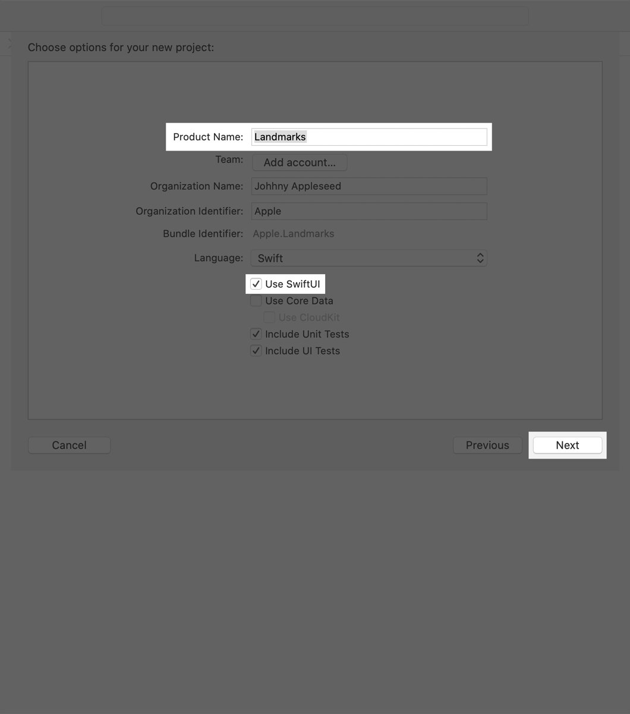
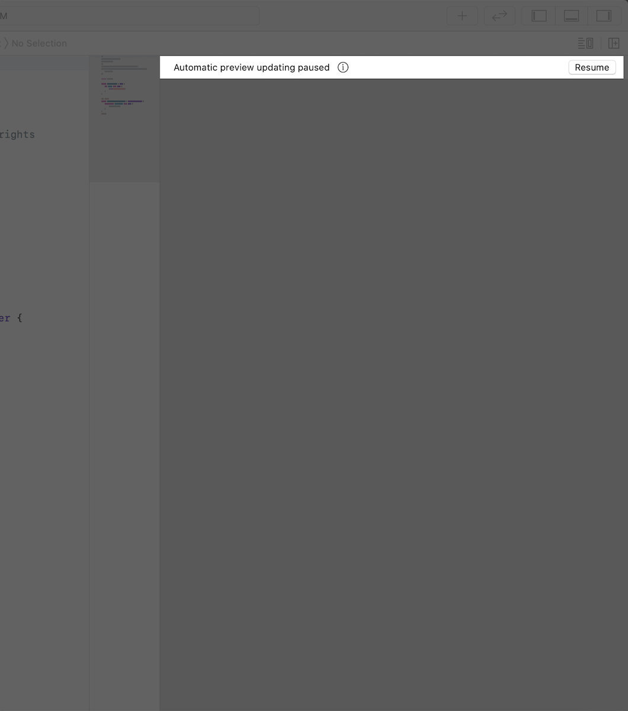
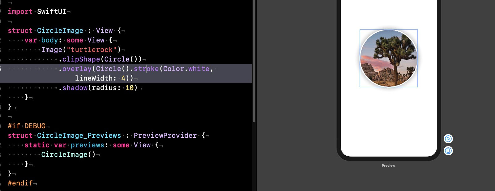
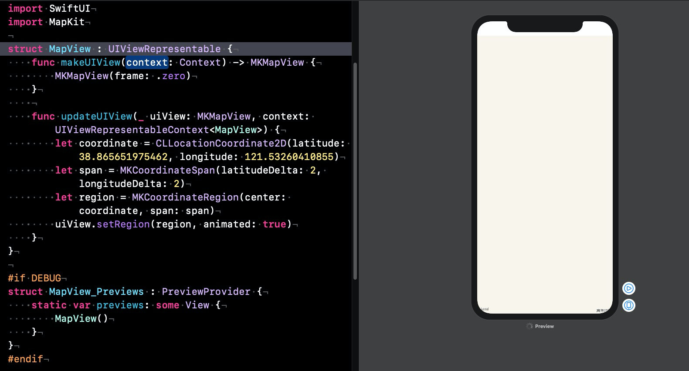
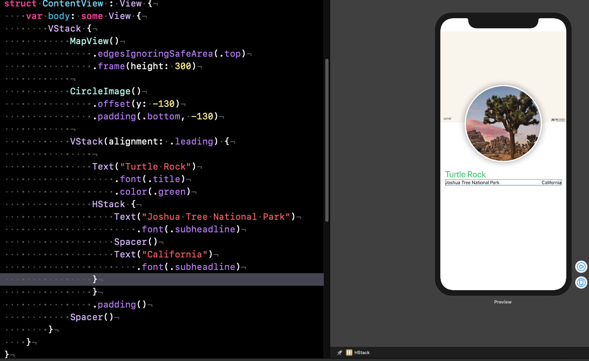
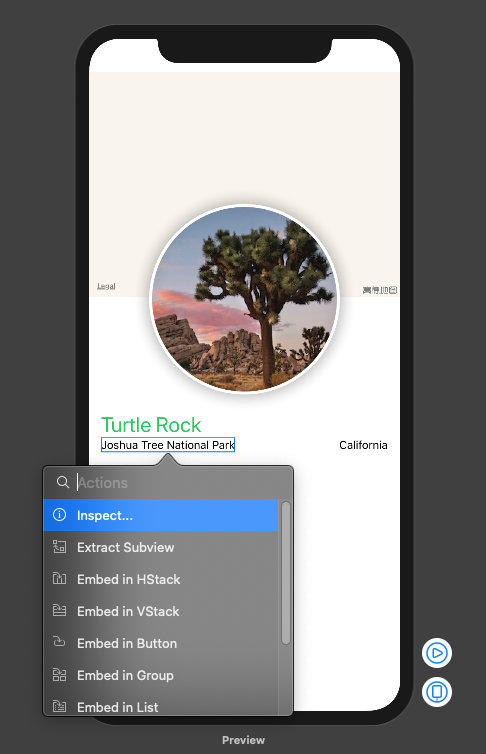
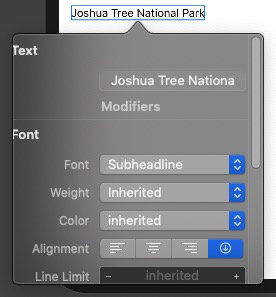
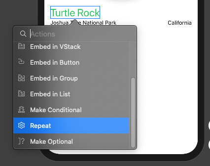
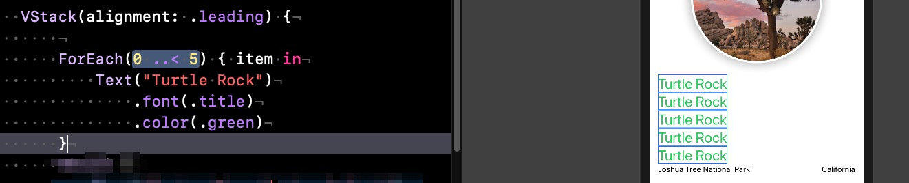

## 什么是SwiftUI？

2019年 WWDC 大会上，苹果宣布了基于Swift语言构建的全新UI框架-SwiftUI。其界面布局完全抛弃了Storyboard和Autolayout，采用了声明式的界面语言(DSL，即Domain Specific Language)，加上 Canvas 的实时预览功能，开发体验有了很大的提升。

自 iOS SDK 2.0 开始，UIKIt已经伴随开发者近十年，其思想继承了成熟的 AppKit 和 MVC， 为iOS开发提高了良好的学习曲线。UIKit提供的是一套符合直觉的、命令式的编程方式，但是由于UIKit的基本思想要求 View Controller 承担绝大部分职责，它需要协调 model，view 以及用户交互，使得在较大型的项目里 View Controller 很臃肿，如果状态管理复杂甚至导致后期代码无法维护。近年来随着编程思想、技术的进步，越来越多的开始使用**声明式**或**函数式**的方式来进行界面开发，现在大热的 React 和 [Flutter](https://link.juejin.im/?target=https%3A%2F%2Fflutterchina.club) 便是采取了声明式编程。

在这种情况下，今年发布的SwiftUI当然也采取了声明式编程。

### 什么是声明式编程

维基百科对命令式、声明式编程的描述如下：

```
声明式编程：是一种不使用控制流来表示计算逻辑的编程范式。
命令式编程：是一种通过语句来改变程序状态的编程范式。
```

举个栗子，当我们要设置一个Text的时候，命令式编程如下

```swift
 override func viewDidLoad() {
        super.viewDidLoad()
        let label = UILabel(frame: CGRect(x: 100, y: 100, width: 100, height: 100))
        label.text = "世界和平"
        label.textColor = .purple
        view.addSubview(label)
    }
```

使用SwiftUI声明式编程时，则：

```swift
 var body: some View {
     Text("世界和平")
    		.color(.purple) 
    }
```

从上面可以看出，UIKit命令式编程是通过一句句的代码来指导“要怎么构建UI”，而声明式编程则是使用各自的DSL来描述“UI应该是什么样子”

### Part01 创建和组合视图

##### 创建工程，☑️Use SwiftUI



##### 点击Resume在画布中恢复预览



##### CircleImage 部分代码



##### MapView 部分代码



##### ContentView部分代码



##### 点击Inspect展开类似xib文件里的可视化编辑，代码也会做出相应的更改





##### 例子：Repeat





### 总结

#### 优点

- 更加 autolayout, 更加相对，以及和系统的适应，比如字体的 head, 比如 leadding， 更接近 Flex 布局
- 远离XIB & Storyboard
- 实时预览 Live preview, 不但可以预览，还可以反向生成代码，真正的微调，可以预览多个 preview，同时适配多个 device
- WatchOS, TVOS, macOS, iOS 会调整适配的UI
- 新实现了UI，抛弃老旧冗余的 UIKit

#### 缺点

- 反应还是有些不灵敏
- ※不适配低于 iOS 13 的设备

